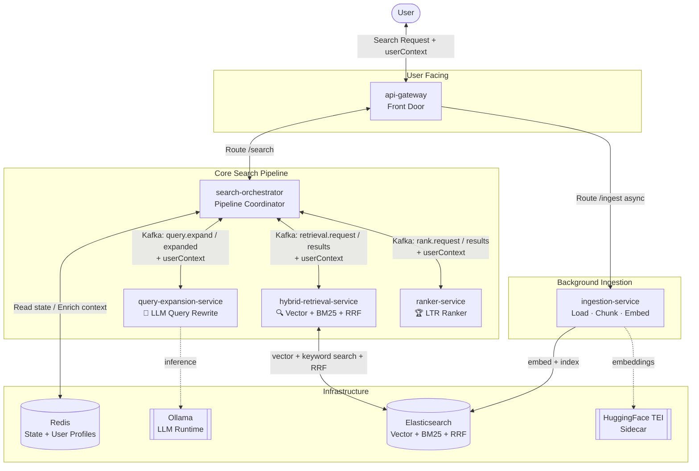
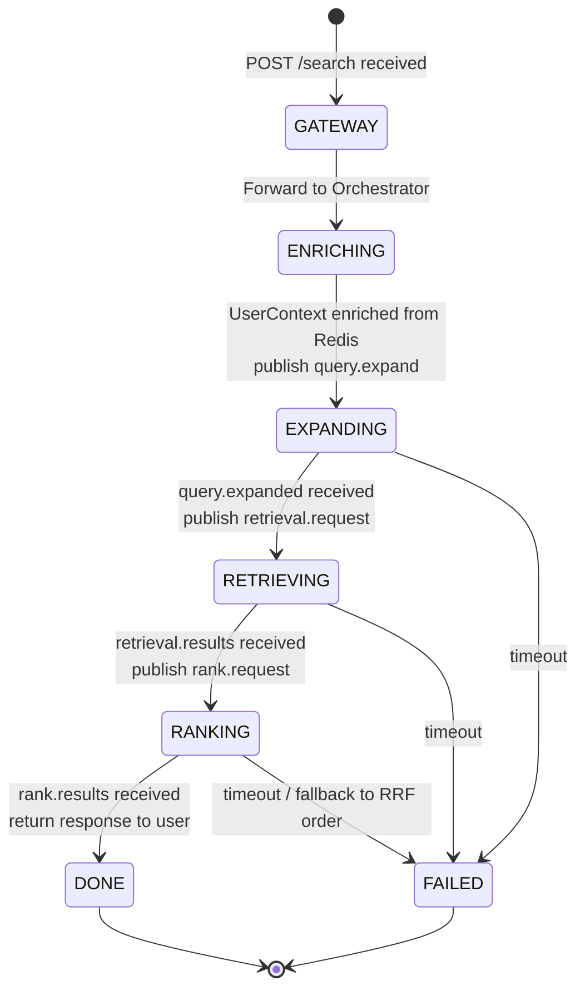
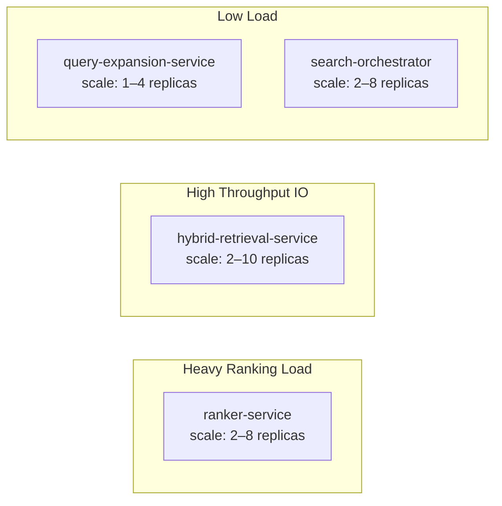

# AGENTIC.md — Agentic Search Pipeline

This document describes the agentic design of the Spring AI Search Engine — how LLM agents are embedded at multiple stages of a fully event-driven Kafka pipeline, each running as an independent microservice. A `UserContext` object (user history, location, preferences) is threaded through every pipeline stage, enabling **personalized** query expansion, retrieval boosting, and ranking.

---

## What Makes This "Agentic"?

A simple RAG system retrieves documents and calls an LLM once. This system uses an LLM at **three independent service stages**, each with a distinct reasoning role:

| Service | Agent Role | LLM Task | User Context Usage |
|---|---|---|---|
| `query-expansion-service` | Planning | Rewrite and expand the user query before search | Uses `recentSearches` + `preferences` to inform variant generation |
| `ranker-service` | Evaluation | Score and rank retrieved candidates by relevance using LTR | Uses full `userContext` as LTR feature signals |

All three are decoupled from each other and from the retrieval layer — connected only via Kafka topics, orchestrated by `search-orchestrator`.

---

## Pipeline Overview


```mermaid
flowchart TD
    U([User])

    subgraph User Facing
        GW[api-gateway<br>Front Door]
    end
    
    subgraph Core Search Pipeline
        ORCH[search-orchestrator<br>Pipeline Coordinator]
        QE[query-expansion-service<br>🧠 LLM Query Rewrite]
        HR[hybrid-retrieval-service<br>🔍 Vector + BM25 + RRF]
        RANK[ranker-service<br>🏆 LTR Ranker]
    end

    subgraph Background Ingestion
        IS[ingestion-service<br>Load · Chunk · Embed]
    end

    subgraph Infrastructure
        ES[(Elasticsearch<br>Vector + BM25 + RRF)]
        OL[[Ollama<br>LLM Runtime]]
        TEI[[HuggingFace TEI<br>Sidecar]]
        REDIS[(Redis<br>State + User Profiles)]
    end

    U <-->|Search Request + userContext| GW
    GW <-->|Route /search| ORCH
    GW -->|Route /ingest async| IS

    ORCH <-->|Read state / Enrich context| REDIS

    ORCH <-->|Kafka: query.expand / expanded<br>+ userContext| QE
    QE -.->|inference| OL
    
    ORCH <-->|Kafka: retrieval.request / results<br>+ userContext| HR
    HR <-->|vector + keyword search + RRF| ES
    
    ORCH <-->|Kafka: rank.request / results<br>+ userContext| RANK

    IS -->|embed + index| ES
    IS -.->|embeddings| TEI
```

---

## Kafka Topic Contracts

All events carry a `correlationId` so the orchestrator can match responses back to the originating user request. Events that participate in the search pipeline also carry a `userContext` object for personalization.

### `UserContext` (shared across all search events)
```json
{
  "userId": "user-123",
  "location": { "lat": 13.7563, "lon": 100.5018 },
  "preferences": ["electronics", "warranty"],
  "recentSearches": ["return laptop", "shipping damage"]
}
```

### `query.expand`
```json
{
  "correlationId": "uuid",
  "query": "can I get money back",
  "userContext": { "userId": "user-123", "..." }
}
```

### `query.expanded`
```json
{
  "correlationId": "uuid",
  "originalQuery": "can I get money back",
  "variants": ["can I get money back", "refund policy for electronics", "return and reimbursement process"]
}
```

### `retrieval.request`
```json
{
  "correlationId": "uuid",
  "originalQuery": "can I get money back",
  "variants": ["can I get money back", "refund policy for electronics", "return and reimbursement process"],
  "topK": 20,
  "userContext": { "userId": "user-123", "..." }
}
```

### `retrieval.results`
```json
{
  "correlationId": "uuid",
  "candidates": [
    { "id": "doc-uuid", "content": "...", "score": 0.91, "source": "rrf" },
    { "id": "doc-uuid", "content": "...", "score": 0.87, "source": "rrf" }
  ]
}
```

### `rank.request`
```json
{
  "correlationId": "uuid",
  "query": "can I get money back",
  "candidates": [ "...20 documents..." ],
  "userContext": { "userId": "user-123", "..." }
}
```

### `rank.results`
```json
{
  "correlationId": "uuid",
  "ranked": [
    { "id": "doc-uuid", "content": "...", "score": 9.2 },
    { "id": "doc-uuid", "content": "...", "score": 7.8 }
  ]
}
```

---

## api-gateway & search-orchestrator

### Responsibility

`api-gateway` acts as the front door edge proxy (routing `/ingest` and `/search`).
`search-orchestrator` drives the background pipeline by publishing to each stage's input topic in sequence and waiting for the corresponding result topic, matched by `correlationId`.

The orchestrator also **enriches the `UserContext`** — when a search request arrives with a `userId`, it loads the full user profile (search history, location, preferences) from Redis and attaches it to every downstream Kafka event.

It does **not** perform any LLM or retrieval work itself — it is a pure coordinator.

### State Machine per Request


```mermaid
stateDiagram-v2
    [*] --> GATEWAY: POST /search received
    GATEWAY --> ENRICHING: Forward to Orchestrator
    ENRICHING --> EXPANDING: UserContext enriched from Redis<br>publish query.expand
    EXPANDING --> RETRIEVING: query.expanded received<br>publish retrieval.request
    RETRIEVING --> RANKING: retrieval.results received<br>publish rank.request
    RANKING --> DONE: rank.results received<br>return response to user
    EXPANDING --> FAILED: timeout
    RETRIEVING --> FAILED: timeout
    RANKING --> FAILED: timeout / fallback to RRF order
    DONE --> [*]
    FAILED --> [*]
```

### Implementation

```java
@Service
public class PipelineOrchestrator {

    private final PipelineStateStore stateStore; // Backed by Redis

    public CompletableFuture<SearchResponse> search(String query, UserContext userContext) {
        String correlationId = UUID.randomUUID().toString();
        CompletableFuture<SearchResponse> future = new CompletableFuture<>();

        // Enrich userContext — load full profile from Redis if only userId is provided
        UserContext enriched = userContextEnricher.enrich(userContext);
        
        // Save initial state to Redis to allow distributed tracking
        stateStore.save(correlationId, new PipelineState(query, enriched));

        publisher.publish("query.expand", new QueryExpandEvent(correlationId, query, enriched));
        return future;
    }

    // Called by ResultConsumer when each topic result arrives
    public void onQueryExpanded(QueryExpandedEvent event) {
        PipelineState state = stateStore.get(event.correlationId());
        // Update state in Redis
        stateStore.save(event.correlationId(), state.withExpanded());
        publisher.publish("retrieval.request", new RetrievalRequestEvent(
            event.correlationId(), event.originalQuery(), event.variants(), 20, state.userContext()
        ));
    }

    public void onRetrievalResults(RetrievalResultEvent event) { ... }
    
    public void onRankResults(RankResultEvent event) {
        PipelineState state = stateStore.get(event.correlationId());
        stateStore.delete(event.correlationId());
        // resolve future based on correlationId mapping (local memory or SSE)
        state.future().complete(new SearchResponse(event.ranked()));
    }
}
```

---

## Stage 0: ingestion-service (Async Data Pipeline)

### Purpose

While not an LLM agentic search stage itself, the ingestion layer is foundational to providing the required vectors for the downstream retriever and generative models. It avoids blocking user HTTP limits during heavy document parsing (`Tika`) and LLM embedding by adopting the **Asynchronous Job Pattern**. Embedded document chunks are written directly to Elasticsearch via Spring AI's `ElasticsearchVectorStore`, which stores both dense vector embeddings and the original text content in a single index — enabling both semantic (knn) and keyword (BM25) retrieval from the same store.

### Architecture Flow

1. **Upload**: Client sends `POST /ingest` with a multipart file.
2. **Spool & Track**: The `IngestionFacade` temporarily spools the file to the OS disk and creates a `PENDING` job record in Elasticsearch (`ingestion_metadata` index). It immediately returns a `202 Accepted` response with the Job ID.
3. **Background Worker**: An `@Async` worker thread (`AsyncIngestionWorker`) picks up the file, extracts text, chunks it, and generates dense vector embeddings via the `TEI Sidecar`.
4. **Index**: Upon completion of embedding, chunks are inserted directly into Elasticsearch via Spring AI's `ElasticsearchVectorStore`, which creates an index with both the dense vector field and the text content — ready for hybrid search.

### Key Implementation Patterns

- **Single Store Architecture**: Elasticsearch serves as both the vector store and the keyword search engine, eliminating the need for a separate CDC pipeline (previously MongoDB → Kafka Connect → Elasticsearch).
- **Configurability**: Zero magic strings — all index names, retention periods, and chunking parameters map cleanly to the `.env` environment configuration.
- **Lifecycle Management**: A `@Scheduled` routine (`TempFileCleanupTask`) securely sweeps the OS directory to delete aging spooled files older than 1 day so resources don't leak.

---

## Stage 1: query-expansion-service

### Purpose

User queries are often short, ambiguous, or use different vocabulary than the indexed documents. This service rewrites the original query into multiple variants to improve recall — ensuring we don't miss relevant documents because of vocabulary mismatch.

When `userContext` is present, the LLM uses **recent search history** and **user preferences** to generate more targeted variants. For example, if a user frequently searches for "electronics" and queries "return policy", the LLM may generate "electronics return policy" as a variant.

### Kafka Flow

```
Consumes: query.expand
Produces: query.expanded
```

### Implementation

```java
@KafkaListener(topics = "query.expand")
public void consume(QueryExpandEvent event) {
    // Pass userContext to the LLM for context-aware expansion
    List<String> variants = expansionService.expand(event.query(), event.userContext());
    publisher.send("query.expanded", new QueryExpandedEvent(
        event.correlationId(), event.query(), variants
    ));
}
```

### LLM Prompt

```java
private static final String EXPANSION_PROMPT = """
    You are a search assistant. Given a user query, produce 2 alternative
    search queries that capture the same intent using different wording.
    
    Rules:
    - Keep each variant concise (under 15 words)
    - Do not add new meaning not implied by the original
    - Use the user's recent searches and preferences to inform your variants
    - Output ONLY a JSON array of strings, no explanation
    
    Original query: {query}
    User preferences: {preferences}
    Recent searches: {recentSearches}
    
    Output format: ["variant 1", "variant 2"]
    """;
```

### Example

Input: `"can I get money back"`

Output:
```json
["can I get money back", "refund policy", "return and reimbursement process"]
```

---

## Stage 2: hybrid-retrieval-service

### Purpose

Single-mode retrieval has known weaknesses — vector search alone misses exact keyword matches; BM25 alone misses semantic matches. This service leverages Elasticsearch's native **Reciprocal Rank Fusion (RRF)** retriever to combine both dense vector (`knn`) and BM25 keyword results in a single query — eliminating the need for application-level fusion logic.

When `userContext` is present, the service applies **personalized boosting**:
- **Geo-proximity boost** — documents tagged with a location closer to the user's `location` are boosted via `geo_distance` function score
- **Preference boost** — documents matching the user's `preferences` categories receive a field-level boost

### Kafka Flow

```
Consumes: retrieval.request
Produces: retrieval.results
```

### Implementation

```java
@KafkaListener(topics = "retrieval.request")
public void consume(RetrievalRequestEvent event) {
    // Elasticsearch handles vector + keyword + RRF natively in a single query
    // UserContext enables geo-boosting and preference-based field boosting
    List<Document> results = hybridSearchService.search(
        event.originalQuery(), event.variants(), event.topK(), event.userContext()
    );

    publisher.send("retrieval.results", new RetrievalResultEvent(
        event.correlationId(), results
    ));
}
```

### Elasticsearch RRF Query

Elasticsearch 8.x supports a native `rrf` retriever that combines multiple sub-retrievers:

```json
{
  "retriever": {
    "rrf": {
      "retrievers": [
        {
          "standard": {
            "query": {
              "match": { "content": "refund policy" }
            }
          }
        },
        {
          "knn": {
            "field": "embedding",
            "query_vector": [0.12, -0.34, ...],
            "k": 20,
            "num_candidates": 100
          }
        }
      ],
      "rank_constant": 60,
      "rank_window_size": 100
    }
  }
}
```

Each document's final score combines its rank across both retrieval lists:

```
RRF_score(doc) = Σ  1 / (k + rank_in_list)    where k = 60 (rank_constant)
                lists
```

This replaces the previous architecture where MongoDB handled vector search, Elasticsearch handled BM25 keyword search, and application-level `RRFMerger` combined the results.

---

## Stage 3: ranker-service ✅ LTR (Learn to Rank)

### Purpose

After hybrid retrieval, we have up to 20 candidate documents. Not all are truly relevant. The ranker re-evaluates each document against the **original query** using a Learn to Rank (LTR) model and returns only the top-5 most relevant.

The `userContext` is consumed as **additional LTR features** — user preferences, location, and search history become input features alongside document features (BM25 score, vector similarity, length, recency), enabling the model to learn personalized relevance patterns.

### Kafka Flow

```
Consumes: rank.request
Produces: rank.results
```

### Implementation

```java
@KafkaListener(topics = "rank.request")
public void consume(RankRequestEvent event) {
    List<RankedDocument> ranked;
    try {
        // UserContext is used as additional LTR feature signals
        ranked = documentRanker.rank(event.query(), event.candidates(), event.userContext());
    } catch (Exception e) {
        // Fallback: return original RRF order, top-5
        ranked = event.candidates().stream().limit(5)
            .map(d -> new RankedDocument(d, 0.0))
            .toList();
    }
    publisher.send("rank.results", new RankResultEvent(event.correlationId(), ranked));
}
```

### Output Model

```java
public record RankedDocument(
    String id,
    String content,
    Map<String, Object> metadata,
    double score
) {}
```

---

---

## Ollama Configuration

Ollama is used by the `query-expansion-service` for intelligent query rewriting before search:

```yaml
# application.yml (shared base)
spring:
  ai:
    ollama:
      base-url: ${OLLAMA_BASE_URL:http://localhost:11434}
      chat:
        options:
          model: llama3.2
          temperature: 0.0      # deterministic for expansion and reranking
    
    # HuggingFace TEI is used exclusively for vector embeddings
    openai:
      base-url: ${SPRING_AI_OPENAI_BASE_URL:http://tei-sidecar:8080}
      api-key: dummy_key_for_tei 
      embedding:
        options:
          model: nomic-ai/nomic-embed-text-v1.5

search:
  pipeline:
    expansion:
      model: llama3.2
```

---

## Error Handling & Fallbacks

| Service | Failure Mode | Fallback |
|---|---|---|
| `query-expansion-service` | LLM timeout / parse error | Publish original query only as single variant |
| `hybrid-retrieval-service` | Elasticsearch down | Return empty results with error flag |
| `ranker-service` | LTR model error | Return top-5 from RRF order as-is |
| `search-orchestrator` | Stage timeout (any) | Return partial result with error flag |

---

## Observability

Each service emits Micrometer metrics and OpenTelemetry spans. The `correlationId` is propagated as a trace attribute across all Kafka hops.

```java
// Example annotation on ranker
@Observed(name = "ranker.score", contextualName = "ltr-rank")
public List<RankedDocument> rank(String query, List<Document> candidates) { ... }
```

Key metrics per service:

| Metric | Description |
|---|---|
| `pipeline.stage.latency` | Time per Kafka hop (tagged by service) |
| `llm.tokens.used` | Token count per Ollama call |
| `retrieval.candidates.count` | Documents returned per retrieval |
| `ranker.score.distribution` | Histogram of LTR relevance scores |
| `kafka.consumer.lag` | Per-topic consumer lag for autoscaling signals |

---

## Scaling Guide

Because each stage is an independent Kafka consumer group, they scale independently:


```mermaid
flowchart LR
    subgraph Heavy Ranking Load
        RANK[ranker-service\nscale: 2–8 replicas]
    end

    subgraph High Throughput IO
        HR[hybrid-retrieval-service\nscale: 2–10 replicas]
    end

    subgraph Low Load
        QE[query-expansion-service\nscale: 1–4 replicas]
        GW[search-orchestrator\nscale: 2–8 replicas]
    end
```

Scale trigger: **Kafka consumer lag** per topic is the most reliable signal. Configure KEDA or HPA with custom metrics for lag-based autoscaling.

Kubernetes manifests (Deployments, Services, HPAs) are maintained in:
**[github.com/Peqchji/k8s-lab — branch: spring-ai-search-engine](https://github.com/Peqchji/k8s-lab/tree/spring-ai-search-engine)**

---

## Future Enhancements

- **Query routing** — orchestrator classifies query type (factual vs. conversational) and skips expansion for simple lookups
- **Passage Highlighting** — return precise highlight snippets from the `ranker-service` directly to the client interface
- **Session memory** — pass prior turns into `query-expansion-service` for multi-turn search context
- **Evaluation harness** — offline NDCG / MRR scoring against labeled query sets to benchmark ranker quality across model upgrades
