# AGENTIC.md — Agentic Search Pipeline

This document describes the agentic components of the Spring AI Search Engine — how the system uses an LLM not only for answer generation, but also for active query understanding and reranking at each stage of the search pipeline.

---

## What Makes This "Agentic"?

A simple RAG system retrieves documents and feeds them to an LLM once. This system uses an LLM at **three separate stages**, each with a distinct role:

| Stage | Agent Role | LLM Task |
|---|---|---|
| 1 — Query Expansion | Planning | Rewrite and expand the user query before search |
| 3 — Reranking | Evaluation | Score and rank retrieved candidates by relevance |
| 4 — Answer Generation | Synthesis | Produce a grounded answer from top-N documents |

This creates a **pipeline where the LLM actively shapes both the retrieval and the response** — not just generation.

---

## Pipeline Overview

```mermaid
flowchart TD
    Q([User Query]) --> S1

    S1["Stage 1 · QueryExpansionService\n🧠 LLM Agent\nExpand query into 2–3 variants"]
    S1 -->|"expanded variants"| S2

    subgraph S2["Stage 2 · HybridRetrievalService\n⚙️ Deterministic"]
        V[Dense · Vector Search]
        BM[Sparse · BM25 / FTS]
        RRF[RRF Merge]
        V --> RRF
        BM --> RRF
    end

    S2 -->|"top-20 candidates"| S3

    S3["Stage 3 · LLMReranker\n🏆 LLM Agent — KEEP as-is\nScore each doc · return top-5"]
    S3 -->|"top-5 reranked docs"| S4

    S4["Stage 4 · AnswerGenerationService\n✍️ LLM Agent\nRAG generation"]
    S4 --> Out([Final Response\nanswer + citations])
```



---

## Stage 1: Query Expansion

### Purpose

User queries are often short, ambiguous, or use different vocabulary than the indexed documents. Query expansion rewrites the original query into multiple variants to improve **recall** in retrieval — ensuring we don't miss relevant documents just because words don't match exactly.

### Implementation

**Class:** `QueryExpansionService`

```java
@Service
public class QueryExpansionService {

    private final ChatClient chatClient;

    private static final String EXPANSION_PROMPT = """
        You are a search assistant. Given a user's query, produce 2 alternative 
        search queries that capture the same intent using different wording.
        
        Rules:
        - Keep each variant concise (under 15 words)
        - Do not add new meaning not implied by the original
        - Output ONLY a JSON array of strings, no explanation
        
        Original query: {query}
        
        Output format: ["variant 1", "variant 2"]
        """;

    public List<String> expand(String originalQuery) {
        String raw = chatClient.prompt()
            .user(u -> u.text(EXPANSION_PROMPT).param("query", originalQuery))
            .call()
            .content();
        // Parse JSON array → List<String>
        List<String> variants = parseJsonArray(raw);
        // Always include the original
        variants.add(0, originalQuery);
        return variants;
    }
}
```

### Example

Input: `"can I get money back"`

Expanded:
```json
["can I get money back", "refund policy", "return and reimbursement process"]
```

All three variants are used in Stage 2 retrieval (deduplicated by document ID before merging).

---

## Stage 2: Hybrid Retrieval

### Purpose

Single-mode retrieval has known weaknesses:
- **Vector search alone** misses exact keyword matches (product names, codes, IDs)
- **BM25 alone** misses semantic matches (synonyms, paraphrases)

Hybrid retrieval runs both and merges results using **Reciprocal Rank Fusion (RRF)**.

### Implementation

**Class:** `HybridRetrievalService`

```java
@Service
public class HybridRetrievalService {

    private final VectorStore vectorStore;
    private final ElasticsearchService elasticsearchService;
    private final RRFMerger rrfMerger;

    public List<Document> retrieve(List<String> queryVariants, int topK) {
        List<Document> vectorResults = new ArrayList<>();
        List<Document> keywordResults = new ArrayList<>();

        for (String variant : queryVariants) {
            vectorResults.addAll(
                vectorStore.similaritySearch(SearchRequest.query(variant).withTopK(20))
            );
            keywordResults.addAll(
                elasticsearchService.bm25Search(variant, 20)
            );
        }

        return rrfMerger.merge(vectorResults, keywordResults, topK);
    }
}
```

### RRF Merge Algorithm

**Class:** `RRFMerger` (in `shared` module)

RRF avoids the need to normalize scores across different retrieval systems. Each document's final score is:

```
RRF_score(doc) = Σ  1 / (k + rank_in_list)
                lists

where k = 60  (standard constant)
```

```java
public List<Document> merge(
    List<Document> vectorDocs, 
    List<Document> keywordDocs, 
    int topK
) {
    Map<String, Double> scores = new HashMap<>();
    int k = 60;

    rankDocuments(vectorDocs, scores, k);
    rankDocuments(keywordDocs, scores, k);

    return scores.entrySet().stream()
        .sorted(Map.Entry.<String, Double>comparingByValue().reversed())
        .limit(topK)
        .map(e -> findDocById(e.getKey(), vectorDocs, keywordDocs))
        .toList();
}
```

---

## Stage 3: LLM Reranker ✅ (Kept Unchanged)

### Purpose

After hybrid retrieval, we have up to 20 candidate documents. Not all of them are truly relevant. The LLM reranker re-evaluates each document against the **original query** and assigns a relevance score, returning only the top-N most relevant.

This is kept as **LLM-only** (no cross-encoder models, no learned reranker weights) — the LLM itself judges relevance.

### Design Decisions

- **Why LLM-only?** Avoids maintaining a separate embedding/cross-encoder model. The same LLM used for generation is repurposed for evaluation, keeping the stack simple.
- **Batch scoring:** All candidates are scored in a single LLM call to reduce latency.
- **Fallback:** If LLM reranking fails (timeout, parse error), fall back to the original RRF-ordered list.

### Implementation

**Class:** `LLMReranker`

```java
@Service
public class LLMReranker {

    private final ChatClient chatClient;

    private static final String RERANK_PROMPT = """
        You are a relevance judge. Given a search query and a list of document passages,
        score each passage from 0 to 10 based on how well it answers the query.
        
        Query: {query}
        
        Passages:
        {passages}
        
        Rules:
        - 10 = directly and completely answers the query
        - 5  = partially relevant
        - 0  = irrelevant
        - Output ONLY valid JSON: [{"id": "...", "score": N}, ...]
        - Do not explain your reasoning
        """;

    public List<RankedDocument> rerank(String query, List<Document> candidates) {
        String passagesJson = buildPassagesJson(candidates);

        String raw = chatClient.prompt()
            .user(u -> u.text(RERANK_PROMPT)
                .param("query", query)
                .param("passages", passagesJson))
            .call()
            .content();

        return parseScores(raw, candidates)
            .stream()
            .sorted(Comparator.comparingDouble(RankedDocument::score).reversed())
            .limit(5)
            .toList();
    }

    private String buildPassagesJson(List<Document> docs) {
        // Format: [{"id": "uuid", "text": "...truncated to 300 chars..."}, ...]
        return docs.stream()
            .map(d -> Map.of("id", d.getId(), "text", truncate(d.getContent(), 300)))
            .collect(toJson());
    }
}
```

### Prompt Considerations

- Passages are **truncated to ~300 characters** per document to fit within context limits when scoring 20 candidates at once
- The LLM is instructed to output **only JSON** to enable reliable parsing
- A `score` threshold can optionally filter out documents below a minimum relevance (e.g., discard score < 3)

### Reranker Output Model

```java
public record RankedDocument(
    String id,
    String content,
    Map<String, Object> metadata,
    double score          // LLM relevance score 0–10
) {}
```

---

## Stage 4: Answer Generation

### Purpose

After reranking, the top-5 documents are assembled as **context** and fed to the LLM for final answer generation. This is standard RAG, but grounded in high-quality, reranked documents.

### Implementation

**Class:** `AnswerGenerationService`

```java
@Service
public class AnswerGenerationService {

    private final ChatClient chatClient;

    private static final String RAG_PROMPT = """
        You are a helpful assistant. Answer the user's question using ONLY the 
        provided context. If the context does not contain enough information to 
        answer, say so clearly — do not fabricate.
        
        Context:
        {context}
        
        Question: {question}
        
        Answer:
        """;

    public SearchResult generate(String query, List<RankedDocument> topDocs) {
        String context = topDocs.stream()
            .map(RankedDocument::content)
            .collect(Collectors.joining("\n\n---\n\n"));

        String answer = chatClient.prompt()
            .user(u -> u.text(RAG_PROMPT)
                .param("question", query)
                .param("context", context))
            .call()
            .content();

        return new SearchResult(answer, topDocs);
    }
}
```

---

## Pipeline Orchestration

The four stages are wired together in a single pipeline bean:

**Class:** `SearchPipelineConfig`

```java
@Configuration
public class SearchPipelineConfig {

    @Bean
    public Function<SearchRequest, SearchResult> searchPipeline(
        QueryExpansionService expansion,
        HybridRetrievalService retrieval,
        LLMReranker reranker,
        AnswerGenerationService generator
    ) {
        return request -> {
            // Stage 1: Expand query
            List<String> variants = expansion.expand(request.query());

            // Stage 2: Hybrid retrieve
            List<Document> candidates = retrieval.retrieve(variants, 20);

            // Stage 3: LLM rerank
            List<RankedDocument> top5 = reranker.rerank(request.query(), candidates);

            // Stage 4: Generate answer
            return generator.generate(request.query(), top5);
        };
    }
}
```

---

## LLM Configuration

All three LLM-using stages share the same `ChatClient` bean but can be independently configured with different models or parameters via Spring AI's `ChatOptions`:

```yaml
# application.yml
spring:
  ai:
    openai:
      api-key: ${OPENAI_API_KEY}
      chat:
        options:
          model: gpt-4o-mini        # cost-effective default
          temperature: 0.0          # deterministic for reranking/expansion
          max-tokens: 1000

search:
  pipeline:
    expansion:
      model: gpt-4o-mini
    reranker:
      model: gpt-4o-mini            # or upgrade to gpt-4o for precision
      fallback-on-error: true
    generation:
      model: gpt-4o
      max-tokens: 2000
```

---

## Error Handling & Fallbacks

| Stage | Failure Mode | Fallback |
|---|---|---|
| Query Expansion | LLM timeout / parse error | Use original query only |
| Hybrid Retrieval | Elasticsearch down | Fall back to vector-only search |
| LLM Reranker | LLM timeout / parse error | Use RRF-ordered list as-is |
| Answer Generation | LLM timeout | Return top document content directly |

---

## Observability

Each stage emits metrics via **Micrometer** and spans via **OpenTelemetry**:

```java
// Example: reranker span
@Observed(name = "search.reranker", contextualName = "llm-rerank")
public List<RankedDocument> rerank(String query, List<Document> candidates) { ... }
```

Key metrics to track:

- `search.pipeline.latency` — end-to-end latency per stage
- `llm.tokens.used` — token count per LLM call (for cost monitoring)
- `search.reranker.score.distribution` — histogram of relevance scores returned
- `search.retrieval.candidate.count` — how many docs reached each stage

---

## Future Enhancements

- **Query routing** — classify query type (factual vs. conversational) and route to different pipeline variants
- **Session memory** — include prior turns in query expansion context for multi-turn search
- **Streaming responses** — stream the answer generation stage via Spring AI's streaming `ChatClient`
- **Evaluation harness** — offline NDCG / MRR evaluation against labeled query sets to measure reranker quality
