# AGENTIC.md — Agentic Search Pipeline

This document describes the agentic design of the Spring AI Search Engine — how LLM agents are embedded at multiple stages of a fully event-driven Kafka pipeline, each running as an independent microservice.

---

## What Makes This "Agentic"?

A simple RAG system retrieves documents and calls an LLM once. This system uses an LLM at **three independent service stages**, each with a distinct reasoning role:

| Service | Agent Role | LLM Task |
|---|---|---|
| `query-expansion-service` | Planning | Rewrite and expand the user query before search |
| `ranker-service` | Evaluation | Score and rank retrieved candidates by relevance using LTR |

All three are decoupled from each other and from the retrieval layer — connected only via Kafka topics, orchestrated by `search-orchestrator`.

---

## Pipeline Overview

```mermaid
flowchart TD
    Q([User Query]) --> GW

    subgraph User Facing
        GW[api-gateway<br>Front Door]
    end

    subgraph Core Search Pipeline
        ORCH[search-orchestrator<br>Pipeline Coordinator]
        S1["query-expansion-service<br>🧠 LLM Agent<br>Expand query into variants"]
        S2["hybrid-retrieval-service<br>⚙️ Deterministic<br>Vector + BM25 + RRF"]
        S3["ranker-service<br>🏆 LTR Agent<br>Score candidates · return top-5"]
    end

    subgraph Background Ingestion
        INGEST["ingestion-service<br>Load · Embed · Input"]
    end

    subgraph Infrastructure
        TEI[[HuggingFace TEI Sidecar<br>High-speed Embeddings]]
        MDB[(MongoDB)]
        KAFKADOCS[[Kafka raw-docs Topic]]
        ES[(Elasticsearch Indexer)]
    end

    GW --> ORCH

    ORCH -->|query.expand| S1
    S1 -->|query.expanded| ORCH

    ORCH -->|retrieval.request| S2
    S2 -->|retrieval.results| ORCH

    ORCH -->|rank.request| S3
    S3 -->|rank.results| ORCH

    %% Background Data Flow
    Q_Doc([New Document]) -.-> INGEST
    INGEST -.->|vectorize| TEI
    INGEST -.->|insert| MDB
    MDB -.->|Source Connector| KAFKADOCS
    KAFKADOCS -.->|Sink Connector| ES

    ORCH --> R([Final Response])
    GW --> R
```



---

## Kafka Topic Contracts

All events carry a `correlationId` so the orchestrator can match responses back to the originating user request.

### `query.expand`
```json
{
  "correlationId": "uuid",
  "query": "can I get money back"
}
```

### `query.expanded`
```json
{
  "correlationId": "uuid",
  "originalQuery": "can I get money back",
  "variants": ["can I get money back", "refund policy", "return and reimbursement process"]
}
```

### `retrieval.request`
```json
{
  "correlationId": "uuid",
  "originalQuery": "can I get money back",
  "variants": ["can I get money back", "refund policy", "return and reimbursement process"],
  "topK": 20
}
```

### `retrieval.results`
```json
{
  "correlationId": "uuid",
  "candidates": [
    { "id": "doc-uuid", "content": "...", "score": 0.91, "source": "vector" },
    { "id": "doc-uuid", "content": "...", "score": 0.87, "source": "bm25" }
  ]
}
```

### `rank.request`
```json
{
  "correlationId": "uuid",
  "query": "can I get money back",
  "candidates": [ ...20 documents... ]
}
```

### `rank.results`
```json
{
  "correlationId": "uuid",
  "ranked": [
    { "id": "doc-uuid", "content": "...", "score": 9.2 },
    { "id": "doc-uuid", "content": "...", "score": 7.8 }
  ]
}
```

---

## api-gateway & search-orchestrator

### Responsibility

`api-gateway` acts as the front door edge proxy (routing `/ingest` and `/search`).
`search-orchestrator` drives the background pipeline by publishing to each stage's input topic in sequence and waiting for the corresponding result topic, matched by `correlationId`.

It does **not** perform any LLM or retrieval work itself — it is a pure coordinator.

### State Machine per Request


### Implementation

```java
@Service
public class PipelineOrchestrator {

    private final Map<String, PipelineState> stateStore = new ConcurrentHashMap<>();

    public CompletableFuture<SearchResponse> search(String query) {
        String correlationId = UUID.randomUUID().toString();
        CompletableFuture<SearchResponse> future = new CompletableFuture<>();
        stateStore.put(correlationId, new PipelineState(query, future));

        publisher.publish("query.expand", new QueryExpandEvent(correlationId, query));
        return future;
    }

    // Called by ResultConsumer when each topic result arrives
    public void onQueryExpanded(QueryExpandedEvent event) {
        PipelineState state = stateStore.get(event.correlationId());
        publisher.publish("retrieval.request", new RetrievalRequestEvent(
            event.correlationId(), event.originalQuery(), event.variants(), 20
        ));
    }

    public void onRetrievalResults(RetrievalResultEvent event) { ... }
    
    public void onRankResults(RankResultEvent event) {
        PipelineState state = stateStore.remove(event.correlationId());
        state.future().complete(new SearchResponse(event.ranked()));
    }
}
```

---

## Stage 0: ingestion-service (Async Data Pipeline)

### Purpose

While not an LLM agentic search stage itself, the ingestion layer is foundational to providing the required vectors for the downstream retriever and generative models. It avoids blocking user HTTP limits during heavy document parsing (`Tika`) and LLM embedding by adopting the **Asynchronous Job Pattern**. It also implements the **Transactional Outbox Pattern** to guarantee reliable delivery of document chunks seamlessly into the event-driven Kafka core.

### Architecture Flow

1. **Upload**: Client sends `POST /ingest` with a multipart file.
2. **Spool & Track**: The `IngestionFacade` temporarily spools the file to the OS disk and creates a `PENDING` job record in MongoDB (`ingestions` collection). It immediately returns a `202 Accepted` response with the Job ID.
3. **Background Worker**: An `@Async` worker thread (`AsyncIngestionWorker`) picks up the file, extracts text, chunks it, and generates dense vector embeddings via the `TEI Sidecar`.
4. **Persist**: Upon completion of embedding, chunks are inserted natively via Spring AI into the `documents` collection in MongoDB alongside vector bounds.
5. **Relay via Connectors**: A `mongodb-source-connector` deployed in the Kafka Connect framework securely tails the `documents` collection asynchronously, streaming updates into the `raw-docs` Kafka topic. An `elasticsearch-sink-connector` natively digests these embeddings directly.

### Key Implementation Patterns

- **Real-time Change Streams**: Guaranteed event publishing leveraging MongoDB's change stream tailing integrated right into Kafka Source Connect.
- **Configurability**: Zero magic strings — all collection identifiers, event types, retention periods, and chunking parameters map cleanly to the `.env` environment configuration.
- **Lifecycle Management**: A `@Scheduled` routine (`TempFileCleanupTask`) securely sweeps the OS directory to delete aging spooled files older than 1 day so resources don't leak.

---

## Stage 1: query-expansion-service

### Purpose

User queries are often short, ambiguous, or use different vocabulary than the indexed documents. This service rewrites the original query into multiple variants to improve recall — ensuring we don't miss relevant documents because of vocabulary mismatch.

### Kafka Flow

```
Consumes: query.expand
Produces: query.expanded
```

### Implementation

```java
@KafkaListener(topics = "query.expand")
public void consume(QueryExpandEvent event) {
    List<String> variants = expansionService.expand(event.query());
    publisher.send("query.expanded", new QueryExpandedEvent(
        event.correlationId(), event.query(), variants
    ));
}
```

### LLM Prompt

```java
private static final String EXPANSION_PROMPT = """
    You are a search assistant. Given a user query, produce 2 alternative
    search queries that capture the same intent using different wording.
    
    Rules:
    - Keep each variant concise (under 15 words)
    - Do not add new meaning not implied by the original
    - Output ONLY a JSON array of strings, no explanation
    
    Original query: {query}
    
    Output format: ["variant 1", "variant 2"]
    """;
```

### Example

Input: `"can I get money back"`

Output:
```json
["can I get money back", "refund policy", "return and reimbursement process"]
```

---

## Stage 2: hybrid-retrieval-service

### Purpose

Single-mode retrieval has known weaknesses — vector search alone misses exact keyword matches; BM25 alone misses semantic matches. This service runs both in parallel per query variant and merges results using **Reciprocal Rank Fusion (RRF)**.

### Kafka Flow

```
Consumes: retrieval.request
Produces: retrieval.results
```

### Implementation

```java
@KafkaListener(topics = "retrieval.request")
public void consume(RetrievalRequestEvent event) {
    List<Document> vectorResults = new ArrayList<>();
    List<Document> keywordResults = new ArrayList<>();

    for (String variant : event.variants()) {
        vectorResults.addAll(vectorSearchService.search(variant, 20));
        keywordResults.addAll(bm25SearchService.search(variant, 20));
    }

    List<Document> merged = rrfMerger.merge(vectorResults, keywordResults, event.topK());
    publisher.send("retrieval.results", new RetrievalResultEvent(
        event.correlationId(), merged
    ));
}
```

### RRF Algorithm

Each document's final score combines its rank across both retrieval lists:

```
RRF_score(doc) = Σ  1 / (k + rank_in_list)    where k = 60
                lists
```

```java
public List<Document> merge(List<Document> vectorDocs, List<Document> keywordDocs, int topK) {
    Map<String, Double> scores = new HashMap<>();
    int k = 60;

    for (int i = 0; i < vectorDocs.size(); i++)
        scores.merge(vectorDocs.get(i).getId(), 1.0 / (k + i + 1), Double::sum);
    for (int i = 0; i < keywordDocs.size(); i++)
        scores.merge(keywordDocs.get(i).getId(), 1.0 / (k + i + 1), Double::sum);

    return scores.entrySet().stream()
        .sorted(Map.Entry.<String, Double>comparingByValue().reversed())
        .limit(topK)
        .map(e -> findById(e.getKey(), vectorDocs, keywordDocs))
        .toList();
}
```

---

## Stage 3: ranker-service ✅ LTR (Learn to Rank)

### Purpose

After hybrid retrieval, we have up to 20 candidate documents. Not all are truly relevant. The ranker re-evaluates each document against the **original query** using a Learn to Rank (LTR) model and returns only the top-5 most relevant.

### Kafka Flow

```
Consumes: rank.request
Produces: rank.results
```

### Implementation

```java
@KafkaListener(topics = "rank.request")
public void consume(RankRequestEvent event) {
    List<RankedDocument> ranked;
    try {
        ranked = documentRanker.rank(event.query(), event.candidates());
    } catch (Exception e) {
        // Fallback: return original RRF order, top-5
        ranked = event.candidates().stream().limit(5)
            .map(d -> new RankedDocument(d, 0.0))
            .toList();
    }
    publisher.send("rank.results", new RankResultEvent(event.correlationId(), ranked));
}
```

### Output Model

```java
public record RankedDocument(
    String id,
    String content,
    Map<String, Object> metadata,
    double score
) {}
```

---

---

## Ollama Configuration

Ollama is used by the `query-expansion-service` for intelligent query rewriting before search:

```yaml
# application.yml (shared base)
spring:
  ai:
    ollama:
      base-url: ${OLLAMA_BASE_URL:http://localhost:11434}
      chat:
        options:
          model: llama3.2
          temperature: 0.0      # deterministic for expansion and reranking
    
    # HuggingFace TEI is used exclusively for vector embeddings
    openai:
      base-url: ${SPRING_AI_OPENAI_BASE_URL:http://tei-sidecar:8080}
      api-key: dummy_key_for_tei 
      embedding:
        options:
          model: nomic-ai/nomic-embed-text-v1.5

search:
  pipeline:
    expansion:
      model: llama3.2
```

---

## Error Handling & Fallbacks

| Service | Failure Mode | Fallback |
|---|---|---|
| `query-expansion-service` | LLM timeout / parse error | Publish original query only as single variant |
| `hybrid-retrieval-service` | Elasticsearch down | Fall back to MongoDB vector search only |
| `hybrid-retrieval-service` | MongoDB down | Fall back to Elasticsearch BM25 only |
| `ranker-service` | LTR model error | Return top-5 from RRF order as-is |
| `search-orchestrator` | Stage timeout (any) | Return partial result with error flag |

---

## Observability

Each service emits Micrometer metrics and OpenTelemetry spans. The `correlationId` is propagated as a trace attribute across all Kafka hops.

```java
// Example annotation on ranker
@Observed(name = "ranker.score", contextualName = "ltr-rank")
public List<RankedDocument> rank(String query, List<Document> candidates) { ... }
```

Key metrics per service:

| Metric | Description |
|---|---|
| `pipeline.stage.latency` | Time per Kafka hop (tagged by service) |
| `llm.tokens.used` | Token count per Ollama call |
| `retrieval.candidates.count` | Documents returned per retrieval |
| `ranker.score.distribution` | Histogram of LTR relevance scores |
| `kafka.consumer.lag` | Per-topic consumer lag for autoscaling signals |

---

## Scaling Guide

Because each stage is an independent Kafka consumer group, they scale independently:

```mermaid
flowchart LR
    subgraph Heavy Ranking Load
        RANK[ranker-service\nscale: 2–8 replicas]
    end

    subgraph High Throughput IO
        HR[hybrid-retrieval-service\nscale: 2–10 replicas]
    end

    subgraph Low Load
        QE[query-expansion-service\nscale: 1–4 replicas]
        GW[search-orchestrator\nscale: 2–8 replicas]
    end
```



Scale trigger: **Kafka consumer lag** per topic is the most reliable signal. Configure KEDA or HPA with custom metrics for lag-based autoscaling.

Kubernetes manifests (Deployments, Services, HPAs) are maintained in:
**[github.com/Peqchji/k8s-lab — branch: spring-ai-search-engine](https://github.com/Peqchji/k8s-lab/tree/spring-ai-search-engine)**

---

## Future Enhancements

- **Query routing** — orchestrator classifies query type (factual vs. conversational) and skips expansion for simple lookups
- **Passage Highlighting** — return precise highlight snippets from the `ranker-service` directly to the client interface
- **Session memory** — pass prior turns into `query-expansion-service` for multi-turn search context
- **Evaluation harness** — offline NDCG / MRR scoring against labeled query sets to benchmark ranker quality across model upgrades
