# AGENTIC.md — Agentic Search Pipeline

This document describes the agentic design of the Spring AI Search Engine — how LLM agents are embedded at multiple stages of a fully event-driven Kafka pipeline, each running as an independent microservice.

---

## What Makes This "Agentic"?

A simple RAG system retrieves documents and calls an LLM once. This system uses an LLM at **three independent service stages**, each with a distinct reasoning role:

| Service | Agent Role | LLM Task |
|---|---|---|
| `query-expansion-service` | Planning | Rewrite and expand the user query before search |
| `reranker-service` | Evaluation | Score and rank retrieved candidates by relevance |
| `answer-generation-service` | Synthesis | Produce a grounded answer from top-N documents |

All three are decoupled from each other and from the retrieval layer — connected only via Kafka topics, orchestrated by `search-orchestrator`.

---

## Pipeline Overview

```mermaid
flowchart TD
    Q([User Query]) --> ORCH

    ORCH[search-orchestrator<br>Correlation · State · Routing]

    ORCH -->|query.expand| S1["query-expansion-service<br>🧠 LLM Agent<br>Expand query into variants"]
    S1 -->|query.expanded| ORCH

    ORCH -->|retrieval.request| S2["hybrid-retrieval-service<br>⚙️ Deterministic<br>Vector + BM25 + RRF"]
    S2 -->|retrieval.results| ORCH

    ORCH -->|rerank.request| S3["reranker-service<br>🏆 LLM Agent — KEEP<br>Score candidates · return top-5"]
    S3 -->|rerank.results| ORCH

    ORCH -->|answer.request| S4["answer-generation-service<br>✍️ LLM Agent<br>RAG generation"]
    S4 -->|answer.results| ORCH

    ORCH --> R([Final Response])
```



---

## Kafka Topic Contracts

All events carry a `correlationId` so the orchestrator can match responses back to the originating user request.

### `query.expand`
```json
{
  "correlationId": "uuid",
  "query": "can I get money back"
}
```

### `query.expanded`
```json
{
  "correlationId": "uuid",
  "originalQuery": "can I get money back",
  "variants": ["can I get money back", "refund policy", "return and reimbursement process"]
}
```

### `retrieval.request`
```json
{
  "correlationId": "uuid",
  "originalQuery": "can I get money back",
  "variants": ["can I get money back", "refund policy", "return and reimbursement process"],
  "topK": 20
}
```

### `retrieval.results`
```json
{
  "correlationId": "uuid",
  "candidates": [
    { "id": "doc-uuid", "content": "...", "score": 0.91, "source": "vector" },
    { "id": "doc-uuid", "content": "...", "score": 0.87, "source": "bm25" }
  ]
}
```

### `rerank.request`
```json
{
  "correlationId": "uuid",
  "query": "can I get money back",
  "candidates": [ ...20 documents... ]
}
```

### `rerank.results`
```json
{
  "correlationId": "uuid",
  "ranked": [
    { "id": "doc-uuid", "content": "...", "llmScore": 9.2 },
    { "id": "doc-uuid", "content": "...", "llmScore": 7.8 }
  ]
}
```

### `answer.request`
```json
{
  "correlationId": "uuid",
  "query": "can I get money back",
  "context": [ ...top-5 ranked documents... ]
}
```

### `answer.results`
```json
{
  "correlationId": "uuid",
  "answer": "Yes, you can request a refund within 30 days...",
  "sources": [ { "id": "doc-uuid", "excerpt": "..." } ]
}
```

---

## search-orchestrator

### Responsibility

The orchestrator is the sole entry point for search. It drives the pipeline by publishing to each stage's input topic in sequence and waiting for the corresponding result topic, matched by `correlationId`.

It does **not** perform any LLM or retrieval work itself — it is a pure coordinator.

### State Machine per Request


### Implementation

```java
@Service
public class PipelineOrchestrator {

    private final Map<String, PipelineState> stateStore = new ConcurrentHashMap<>();

    public CompletableFuture<SearchResponse> search(String query) {
        String correlationId = UUID.randomUUID().toString();
        CompletableFuture<SearchResponse> future = new CompletableFuture<>();
        stateStore.put(correlationId, new PipelineState(query, future));

        publisher.publish("query.expand", new QueryExpandEvent(correlationId, query));
        return future;
    }

    // Called by ResultConsumer when each topic result arrives
    public void onQueryExpanded(QueryExpandedEvent event) {
        PipelineState state = stateStore.get(event.correlationId());
        publisher.publish("retrieval.request", new RetrievalRequestEvent(
            event.correlationId(), event.originalQuery(), event.variants(), 20
        ));
    }

    public void onRetrievalResults(RetrievalResultEvent event) { ... }
    public void onRerankResults(RerankResultEvent event) { ... }

    public void onAnswerResults(AnswerResultEvent event) {
        PipelineState state = stateStore.remove(event.correlationId());
        state.future().complete(new SearchResponse(event.answer(), event.sources()));
    }
}
```

---

## Stage 1: query-expansion-service

### Purpose

User queries are often short, ambiguous, or use different vocabulary than the indexed documents. This service rewrites the original query into multiple variants to improve recall — ensuring we don't miss relevant documents because of vocabulary mismatch.

### Kafka Flow

```
Consumes: query.expand
Produces: query.expanded
```

### Implementation

```java
@KafkaListener(topics = "query.expand")
public void consume(QueryExpandEvent event) {
    List<String> variants = expansionService.expand(event.query());
    publisher.send("query.expanded", new QueryExpandedEvent(
        event.correlationId(), event.query(), variants
    ));
}
```

### LLM Prompt

```java
private static final String EXPANSION_PROMPT = """
    You are a search assistant. Given a user query, produce 2 alternative
    search queries that capture the same intent using different wording.
    
    Rules:
    - Keep each variant concise (under 15 words)
    - Do not add new meaning not implied by the original
    - Output ONLY a JSON array of strings, no explanation
    
    Original query: {query}
    
    Output format: ["variant 1", "variant 2"]
    """;
```

### Example

Input: `"can I get money back"`

Output:
```json
["can I get money back", "refund policy", "return and reimbursement process"]
```

---

## Stage 2: hybrid-retrieval-service

### Purpose

Single-mode retrieval has known weaknesses — vector search alone misses exact keyword matches; BM25 alone misses semantic matches. This service runs both in parallel per query variant and merges results using **Reciprocal Rank Fusion (RRF)**.

### Kafka Flow

```
Consumes: retrieval.request
Produces: retrieval.results
```

### Implementation

```java
@KafkaListener(topics = "retrieval.request")
public void consume(RetrievalRequestEvent event) {
    List<Document> vectorResults = new ArrayList<>();
    List<Document> keywordResults = new ArrayList<>();

    for (String variant : event.variants()) {
        vectorResults.addAll(vectorSearchService.search(variant, 20));
        keywordResults.addAll(bm25SearchService.search(variant, 20));
    }

    List<Document> merged = rrfMerger.merge(vectorResults, keywordResults, event.topK());
    publisher.send("retrieval.results", new RetrievalResultEvent(
        event.correlationId(), merged
    ));
}
```

### RRF Algorithm

Each document's final score combines its rank across both retrieval lists:

```
RRF_score(doc) = Σ  1 / (k + rank_in_list)    where k = 60
                lists
```

```java
public List<Document> merge(List<Document> vectorDocs, List<Document> keywordDocs, int topK) {
    Map<String, Double> scores = new HashMap<>();
    int k = 60;

    for (int i = 0; i < vectorDocs.size(); i++)
        scores.merge(vectorDocs.get(i).getId(), 1.0 / (k + i + 1), Double::sum);
    for (int i = 0; i < keywordDocs.size(); i++)
        scores.merge(keywordDocs.get(i).getId(), 1.0 / (k + i + 1), Double::sum);

    return scores.entrySet().stream()
        .sorted(Map.Entry.<String, Double>comparingByValue().reversed())
        .limit(topK)
        .map(e -> findById(e.getKey(), vectorDocs, keywordDocs))
        .toList();
}
```

---

## Stage 3: reranker-service ✅ LLM-only (Kept)

### Purpose

After hybrid retrieval, we have up to 20 candidate documents. Not all are truly relevant. The reranker re-evaluates each document against the **original query** using an LLM and returns only the top-5 most relevant.

Kept as **LLM-only** — no cross-encoder models, no learned weights. The same Ollama LLM is repurposed as a relevance judge.

### Kafka Flow

```
Consumes: rerank.request
Produces: rerank.results
```

### Implementation

```java
@KafkaListener(topics = "rerank.request")
public void consume(RerankRequestEvent event) {
    List<RankedDocument> ranked;
    try {
        ranked = reranker.rerank(event.query(), event.candidates());
    } catch (Exception e) {
        // Fallback: return original RRF order, top-5
        ranked = event.candidates().stream().limit(5)
            .map(d -> new RankedDocument(d, 0.0))
            .toList();
    }
    publisher.send("rerank.results", new RerankResultEvent(event.correlationId(), ranked));
}
```

### LLM Prompt

```java
private static final String RERANK_PROMPT = """
    You are a relevance judge. Given a search query and a list of document passages,
    score each passage from 0 to 10 based on how well it answers the query.
    
    Query: {query}
    
    Passages:
    {passages}
    
    Scoring guide:
    - 10 = directly and completely answers the query
    - 5  = partially relevant or tangentially related
    - 0  = irrelevant
    
    Output ONLY valid JSON — no explanation:
    [{"id": "...", "score": N}, ...]
    """;
```

### Design Decisions

- **Batch scoring** — all 20 candidates scored in a single LLM call to reduce Ollama round-trips
- **Truncation** — passages truncated to ~300 chars each to stay within context limits
- **Score threshold** — documents scoring below 3 are discarded before returning top-5
- **Fallback** — any LLM timeout or parse error falls back to the original RRF-ranked order

### Output Model

```java
public record RankedDocument(
    String id,
    String content,
    Map<String, Object> metadata,
    double llmScore    // 0–10
) {}
```

---

## Stage 4: answer-generation-service

### Purpose

Takes the top-5 reranked documents as context and generates a grounded natural language answer using Ollama via Spring AI RAG.

### Kafka Flow

```
Consumes: answer.request
Produces: answer.results
```

### Implementation

```java
@KafkaListener(topics = "answer.request")
public void consume(AnswerRequestEvent event) {
    String context = event.context().stream()
        .map(RankedDocument::content)
        .collect(Collectors.joining("\n\n---\n\n"));

    String answer = chatClient.prompt()
        .user(u -> u.text(RAG_PROMPT)
            .param("question", event.query())
            .param("context", context))
        .call()
        .content();

    publisher.send("answer.results", new AnswerResultEvent(
        event.correlationId(), answer, event.context()
    ));
}
```

### LLM Prompt

```java
private static final String RAG_PROMPT = """
    You are a helpful assistant. Answer the user's question using ONLY the
    provided context. If the context does not contain enough information,
    say so clearly — do not fabricate.
    
    Context:
    {context}
    
    Question: {question}
    
    Answer:
    """;
```

---

## Ollama Configuration

All three LLM services share the same Ollama runtime but can use different models per stage:

```yaml
# application.yml (shared base)
spring:
  ai:
    ollama:
      base-url: ${OLLAMA_BASE_URL:http://localhost:11434}
      chat:
        options:
          model: llama3.2
          temperature: 0.0      # deterministic for expansion and reranking

search:
  pipeline:
    expansion:
      model: llama3.2
    reranker:
      model: llama3.2           # swap to a larger model for better precision
      score-threshold: 3.0
      fallback-on-error: true
    generation:
      model: llama3.2
      num-predict: 2000
      temperature: 0.3          # slight creativity for answer phrasing
```

---

## Error Handling & Fallbacks

| Service | Failure Mode | Fallback |
|---|---|---|
| `query-expansion-service` | LLM timeout / parse error | Publish original query only as single variant |
| `hybrid-retrieval-service` | Elasticsearch down | Fall back to Qdrant vector search only |
| `hybrid-retrieval-service` | Qdrant down | Fall back to Elasticsearch BM25 only |
| `reranker-service` | LLM timeout / parse error | Return top-5 from RRF order as-is |
| `answer-generation-service` | LLM timeout | Return top document content directly as answer |
| `search-orchestrator` | Stage timeout (any) | Return partial result with error flag |

---

## Observability

Each service emits Micrometer metrics and OpenTelemetry spans. The `correlationId` is propagated as a trace attribute across all Kafka hops.

```java
// Example annotation on reranker
@Observed(name = "reranker.score", contextualName = "llm-rerank")
public List<RankedDocument> rerank(String query, List<Document> candidates) { ... }
```

Key metrics per service:

| Metric | Description |
|---|---|
| `pipeline.stage.latency` | Time per Kafka hop (tagged by service) |
| `llm.tokens.used` | Token count per Ollama call |
| `retrieval.candidates.count` | Documents returned per retrieval |
| `reranker.score.distribution` | Histogram of LLM relevance scores |
| `kafka.consumer.lag` | Per-topic consumer lag for autoscaling signals |

---

## Scaling Guide

Because each stage is an independent Kafka consumer group, they scale independently:

```mermaid
flowchart LR
    subgraph Heavy LLM Load
        RR[reranker-service\nscale: 2–8 replicas]
        AG[answer-generation-service\nscale: 1–6 replicas]
    end

    subgraph High Throughput IO
        HR[hybrid-retrieval-service\nscale: 2–10 replicas]
    end

    subgraph Low Load
        QE[query-expansion-service\nscale: 1–4 replicas]
        GW[search-orchestrator\nscale: 2–8 replicas]
    end
```



Scale trigger: **Kafka consumer lag** per topic is the most reliable signal. Configure KEDA or HPA with custom metrics for lag-based autoscaling.

Kubernetes manifests (Deployments, Services, HPAs) are maintained in:
**[github.com/Peqchji/k8s-lab — branch: spring-ai-search-engine](https://github.com/Peqchji/k8s-lab/tree/spring-ai-search-engine)**

---

## Future Enhancements

- **Query routing** — orchestrator classifies query type (factual vs. conversational) and skips expansion for simple lookups
- **Streaming answers** — stream `answer-generation-service` output back to the client via SSE instead of waiting for full completion
- **Session memory** — pass prior turns into `query-expansion-service` for multi-turn search context
- **Evaluation harness** — offline NDCG / MRR scoring against labeled query sets to benchmark reranker quality across model upgrades
