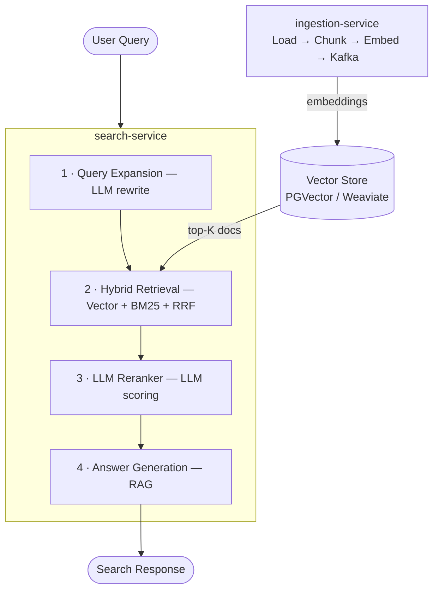
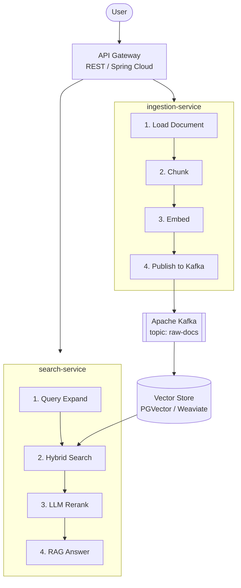
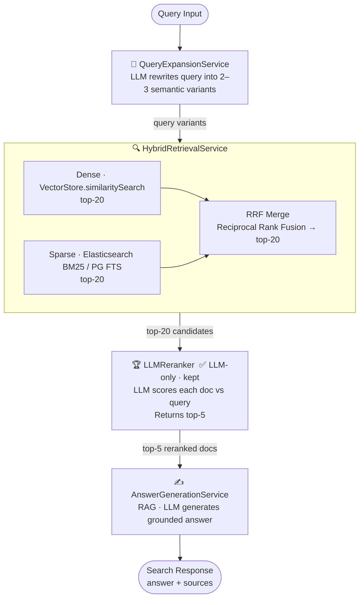

# spring-ai-search-engine

> An Enterprise-grade, Event-Driven AI Search Engine powered by Spring Boot 3.3+, Spring AI, and Kubernetes.

[](https://openjdk.org/projects/jdk/21/)
[](https://spring.io/projects/spring-boot)
[](https://spring.io/projects/spring-ai)
[](https://kubernetes.io/)
[](https://kafka.apache.org/)

---

## 📖 Overview

**Spring AI Search Engine** is a modular, microservices-based intelligent search platform demonstrating a production-grade **AI-Driven Search Pipeline** in Java.

The system evolves beyond simple RAG ("chat with documents") into a full **multi-stage search pipeline** inspired by real-world systems like LINE MAN Wongnai's search evolution — from keyword matching to semantic, intent-aware retrieval with LLM-powered reranking.

### Core Pipeline



---

## 🏗 Architecture

### Full System Architecture



### Search Pipeline Detail



---

## 🚀 Key Features

- **⚡ Event-Driven Ingestion** — uploads are async; heavy processing (PDF parsing, OCR, embedding) doesn't block the user API
- **🔍 Hybrid Search** — combines dense vector search with sparse keyword search (BM25), merged via Reciprocal Rank Fusion (RRF) for best-of-both coverage
- **🧠 Query Expansion** — LLM rewrites ambiguous queries into multiple variants before retrieval, improving recall
- **🏆 LLM Reranking** — after retrieval, an LLM re-scores all candidates against the original query and returns only the most relevant results
- **✍️ RAG Answer Generation** — final answer is grounded in the top-N reranked documents
- **🐳 Kubernetes Native** — Deployment, Service, and HPA manifests for production scaling
- **📊 Observability** — token usage metrics (Micrometer) and distributed tracing (OpenTelemetry)

---

## 🛠 Tech Stack

| Layer | Technology |
|---|---|
| Language | Java 21 |
| Framework | Spring Boot 3.3+, Spring AI 1.0 |
| Messaging | Apache Kafka |
| Vector Store | PGVector (primary) / Weaviate (optional) |
| Keyword Search | Elasticsearch (BM25) / PG Full-Text Search |
| LLM Provider | OpenAI / Azure OpenAI / Ollama (local) |
| Orchestration | Kubernetes (K8s) |
| Observability | Micrometer + OpenTelemetry |

---

## 📦 Module Structure

```
spring-ai-search-engine/
├── ingestion-service/
│   ├── controller/
│   │   └── IngestionController.java        # POST /ingest
│   ├── service/
│   │   ├── DocumentLoaderService.java      # PDF / HTML / text parsing
│   │   ├── ChunkingService.java            # TokenTextSplitter with overlap
│   │   ├── EmbeddingService.java           # Spring AI EmbeddingClient
│   │   └── KafkaDocumentPublisher.java     # Publish to raw-docs topic
│   └── config/
│       └── IngestionConfig.java
│
├── search-service/
│   ├── controller/
│   │   └── SearchController.java           # GET/POST /search
│   ├── pipeline/
│   │   ├── QueryExpansionService.java      # LLM query rewrite (NEW)
│   │   ├── HybridRetrievalService.java     # Vector + BM25 + RRF merge (NEW)
│   │   ├── LLMReranker.java                # LLM-only reranking (KEEP)
│   │   └── AnswerGenerationService.java    # RAG generation (ENHANCED)
│   └── config/
│       └── SearchPipelineConfig.java
│
├── shared/                                 # NEW: shared library
│   ├── model/
│   │   ├── SearchRequest.java
│   │   ├── SearchResult.java
│   │   └── RankedDocument.java
│   └── util/
│       └── RRFMerger.java                  # Reciprocal Rank Fusion
│
├── k8s/
│   ├── namespace.yaml
│   ├── infra/                              # Kafka, PGVector, Elasticsearch
│   └── apps/                              # ingestion-service, search-service
│
└── docker-compose.yml
```

---

## 🏃 Getting Started

### Prerequisites

- Java 21+
- Docker & Docker Compose
- Maven 3.9+

### Environment Variables

```bash
# LLM Provider (choose one)
OPENAI_API_KEY=sk-...
# or for local
OLLAMA_BASE_URL=http://localhost:11434

# Vector Store
SPRING_AI_VECTORSTORE_PGVECTOR_URL=jdbc:postgresql://localhost:5432/vectordb
SPRING_AI_VECTORSTORE_PGVECTOR_USERNAME=postgres
SPRING_AI_VECTORSTORE_PGVECTOR_PASSWORD=secret

# Kafka
SPRING_KAFKA_BOOTSTRAP_SERVERS=localhost:9092

# Elasticsearch (for BM25 hybrid search)
ELASTICSEARCH_URL=http://localhost:9200
```

### Local Development

```bash
# 1. Clone
git clone https://github.com/Peqchji/spring-ai-search-engine.git
cd spring-ai-search-engine
git checkout develop

# 2. Start infrastructure
docker-compose up -d
# Starts: Kafka, PostgreSQL+pgvector, Elasticsearch, Ollama (optional)

# 3. Build all modules
mvn clean install

# 4. Run services
# Terminal A — Ingestion
java -jar ingestion-service/target/ingestion-service.jar

# Terminal B — Search
java -jar search-service/target/search-service.jar
```

### Quick Test

```bash
# Ingest a document
curl -X POST http://localhost:8080/ingest \
  -F "file=@/path/to/document.pdf"

# Search
curl -X POST http://localhost:8081/search \
  -H "Content-Type: application/json" \
  -d '{"query": "What is the refund policy?"}'
```

---

## ☸️ Kubernetes Deployment

```bash
kubectl apply -f k8s/namespace.yaml
kubectl apply -f k8s/infra/      # Kafka, PGVector, Elasticsearch
kubectl apply -f k8s/apps/       # ingestion-service, search-service
```

---

## 🗺 Development Roadmap

| Phase | Goal | Status |
|---|---|---|
| 1 | Stabilize ingestion + basic vector search end-to-end | ✅ In Progress |
| 2 | Add `QueryExpansionService` (LLM query rewrite) | 🔲 Planned |
| 3 | Add hybrid retrieval + RRF merge | 🔲 Planned |
| 4 | Harden `LLMReranker` (prompt tuning, batching) | 🔲 Planned |
| 5 | Observability: token cost tracking, pipeline tracing | 🔲 Planned |

---

## 📄 Documentation

- [`AGENTIC.md`](./AGENTIC.md) — Detailed breakdown of agentic pipeline stages, LLM reranker design, and prompt templates

---

## 📜 License

MIT License. See [LICENSE](./LICENSE) for details.
