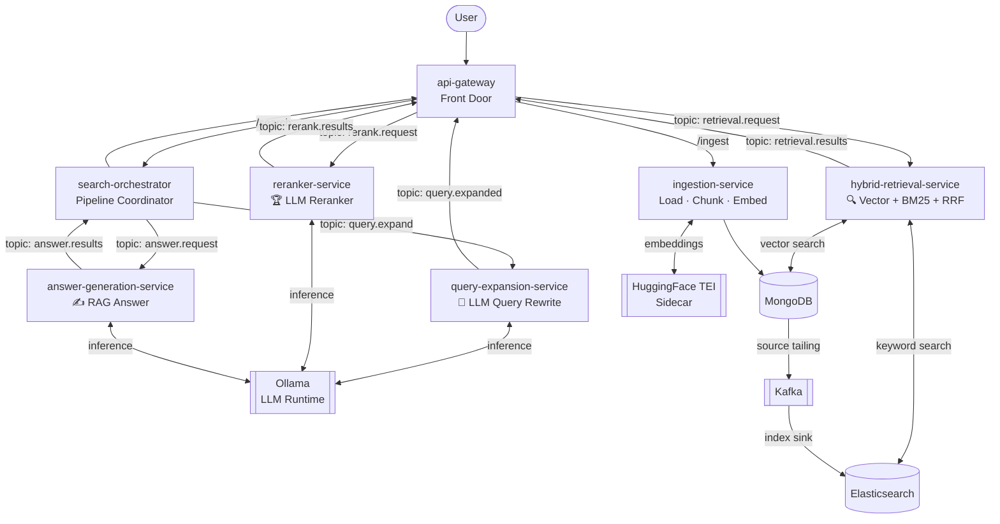
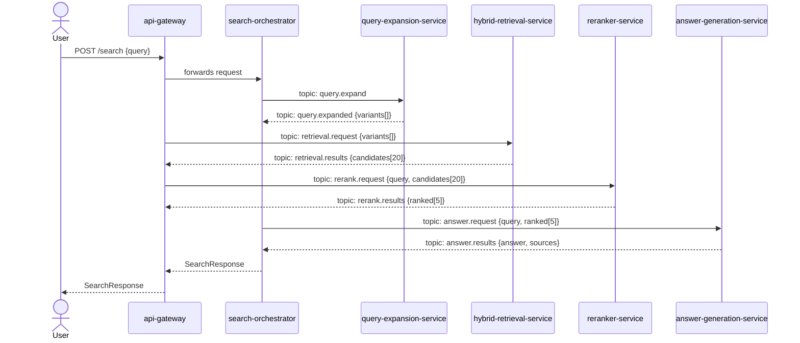

# spring-ai-search-engine

> An Enterprise-grade, Event-Driven AI Search Engine powered by Spring Boot 3.3+, Spring AI, Kafka, and Kubernetes.

[](https://openjdk.org/projects/jdk/21/)
[](https://spring.io/projects/spring-boot)
[](https://spring.io/projects/spring-ai)
[](https://kafka.apache.org/)
[](https://kubernetes.io/)

---

## 📖 Overview

**Spring AI Search Engine** is a fully decomposed, event-driven microservices platform for AI-driven search. Every stage of the search pipeline runs as an **independent service** communicating exclusively over **Apache Kafka** — enabling each component to be scaled, deployed, and tuned in isolation.

The pipeline covers the full journey from user intent to grounded LLM answers — inspired by real-world systems like LINE MAN Wongnai's search evolution from keyword matching to semantic, intent-aware retrieval.

---

## 🏗 Architecture

### Full System Architecture



### Kafka Topic Flow



---

## 📦 Services

| Service | Responsibility | Consumes | Produces |
|---|---|---|---|
| `api-gateway` | Edge proxy, routes incoming traffic | — | — |
| `search-orchestrator` | Pipeline coordination, correlation tracking | `*.results` topics | `*.request` topics |
| `query-expansion-service` | LLM rewrites query into 2–3 semantic variants | `query.expand` | `query.expanded` |
| `hybrid-retrieval-service` | Dense vector + BM25 search, RRF merge | `retrieval.request` | `retrieval.results` |
| `reranker-service` | LLM scores all candidates, returns top-5 | `rerank.request` | `rerank.results` |
| `answer-generation-service` | RAG: LLM generates grounded answer from top-5 docs | `answer.request` | `answer.results` |
| `ingestion-service` | Load, chunk, embed, insert to MongoDB | — | `mongo-documents` (via Source Connector) |

---

## 🗂 Module Structure

```
spring-ai-search-engine/
│
├── api-gateway/                            # Edge Gateway / Front Door
│   └── application.yml                   # Routes /ingest and /search
│
├── search-orchestrator/                  # Pipeline coordinator
│   ├── controller/
│   │   └── SearchController.java         # POST /search
│   ├── pipeline/
│   │   ├── PipelineOrchestrator.java     # Drives Kafka stages by correlationId
│   │   └── PipelineStateStore.java       # In-memory state per in-flight request
│   └── kafka/
│       ├── SearchRequestPublisher.java
│       └── ResultConsumer.java           # Listens on all *.results topics
│
├── query-expansion-service/
│   ├── kafka/
│   │   ├── QueryExpandConsumer.java      # Listens: query.expand
│   │   └── QueryExpandedPublisher.java   # Publishes: query.expanded
│   └── service/
│       └── QueryExpansionService.java    # LLM → variant list
│
├── hybrid-retrieval-service/
│   ├── kafka/
│   │   ├── RetrievalRequestConsumer.java # Listens: retrieval.request
│   │   └── RetrievalResultPublisher.java # Publishes: retrieval.results
│   └── service/
│       ├── VectorSearchService.java      # MongoDB similarity search
│       ├── BM25SearchService.java        # Elasticsearch keyword search
│       └── RRFMerger.java                # Reciprocal Rank Fusion
│
├── reranker-service/
│   ├── kafka/
│   │   ├── RerankRequestConsumer.java    # Listens: rerank.request
│   │   └── RerankResultPublisher.java    # Publishes: rerank.results
│   └── service/
│       └── LLMReranker.java              # LLM-only scoring (KEEP)
│
├── answer-generation-service/
│   ├── kafka/
│   │   ├── AnswerRequestConsumer.java    # Listens: answer.request
│   │   └── AnswerResultPublisher.java    # Publishes: answer.results
│   └── service/
│       └── AnswerGenerationService.java  # RAG prompt + LLM call
│
├── ingestion-service/
│   ├── controller/
│   │   └── IngestionController.java      # POST /ingest (Returns 202 Accepted)
│   ├── model/
│   │   ├── IngestionMetadata.java        # Tracks Job status in MongoDB
│   │   └── OutboxEvent.java              # Outbox pattern for reliable Kafka publishing
│   ├── service/
│       ├── IngestionFacade.java          # Coordinates spooling & background worker
│   │       ├── AsyncIngestionWorker.java     # @Async worker for extraction and embedding
│   │       ├── TempFileCleanupTask.java      # Scheduled OS temp file cleanup
│   │       ├── ChunkingService.java          # TokenTextSplitter with overlaps
│   │       └── EmbeddingService.java         # Spring AI EmbeddingClient (TEI) → MongoDB
│   └── kafka/                              # Kafka Configurations
│
├── shared/                               # Shared library — models + events
│   ├── event/
│   │   ├── QueryExpandEvent.java
│   │   ├── QueryExpandedEvent.java
│   │   ├── RetrievalRequestEvent.java
│   │   ├── RetrievalResultEvent.java
│   │   ├── RerankRequestEvent.java
│   │   ├── RerankResultEvent.java
│   │   ├── AnswerRequestEvent.java
│   │   └── AnswerResultEvent.java
│   ├── model/
│   │   ├── SearchRequest.java
│   │   ├── SearchResponse.java
│   │   └── RankedDocument.java
│   └── util/
│       └── CorrelationIdGenerator.java
│
└── docker-compose.yml

# Kubernetes manifests live in a separate repo:
# https://github.com/Peqchji/k8s-lab/tree/spring-ai-search-engine
```

---

## 🚀 Key Features

- **⚡ Fully Event-Driven** — every pipeline stage communicates exclusively over Kafka; no synchronous HTTP between services
- **📐 Independent Scalability** — scale `reranker-service` and `hybrid-retrieval-service` separately with their own HPAs
- **🔗 Correlation Tracking** — orchestrator tracks each request end-to-end via a `correlationId` threaded through all Kafka events
- **🧠 Query Expansion** — LLM rewrites ambiguous queries into multiple variants before retrieval, improving recall
- **🔍 Hybrid Search** — MongoDB vector search + Elasticsearch BM25 merged via Reciprocal Rank Fusion (RRF)
- **🏆 LLM Reranking** — LLM-only reranker scores all 20 candidates and returns top-5 (no separate cross-encoder model)
- **✍️ Grounded Answers** — RAG generation grounded in top-5 reranked documents via Ollama
- **🌬️ Asynchronous Ingestion** — Heavy parsing and embedding via TEI sidecar are offloaded to background workers returning immediate `202 Accepted`. MongoDB Kafka Source Connectors automatically stream these embedded chunks to Elasticsearch without `outbox` application code.
- **⚙️ Zero Magic Strings** — Fully centralized `.env` configuration via SpEL and `@Value` injections.
- **🐳 Kubernetes Native** — one Deployment + HPA per service for targeted autoscaling
- **📊 Observability** — per-stage latency (Micrometer) and distributed tracing (OpenTelemetry)

---

## 🛠 Tech Stack

| Layer | Technology |
|---|---|
| Language | Java 21 |
| Framework | Spring Boot 3.3+, Spring AI 1.0 |
| Messaging | Apache Kafka |
| Vector Store | MongoDB |
| Keyword Search | Elasticsearch (BM25) |
| Generative LLM | Ollama (local) |
| Embedding API | HuggingFace TEI (Sidecar) |
| Orchestration | Kubernetes (K8s) |
| Observability | Micrometer + OpenTelemetry |

---

## 🏃 Getting Started

### Prerequisites

- Java 21+
- Docker & Docker Compose
- Maven 3.9+

### Environment Variables

```bash
# Ollama
OLLAMA_BASE_URL=http://localhost:11434
OLLAMA_MODEL=llama3.2

# MongoDB Vector Store
SPRING_DATA_MONGODB_URI=mongodb://localhost:27017/ingestion-db
SPRING_AI_VECTORSTORE_MONGODB_COLLECTION_NAME=documents
SPRING_AI_VECTORSTORE_MONGODB_PATH_NAME=embedding
SPRING_AI_VECTORSTORE_MONGODB_INDEX_NAME=vector_index

# Kafka
SPRING_KAFKA_BOOTSTRAP_SERVERS=localhost:9092

# Elasticsearch
ELASTICSEARCH_URL=http://localhost:9200
```

### Local Development

```bash
# 1. Clone
git clone https://github.com/Peqchji/spring-ai-search-engine.git
cd spring-ai-search-engine
git checkout develop

# 2. Start all infrastructure
docker-compose up -d
# Starts: Kafka, MongoDB, Elasticsearch, Ollama, API Gateway, and Ingestion Service (w/ TEI sidecar)

# 3. Build all modules
mvn clean install

# 4. Start each service (separate terminals)
java -jar ingestion-service/target/ingestion-service.jar
java -jar query-expansion-service/target/query-expansion-service.jar
java -jar hybrid-retrieval-service/target/hybrid-retrieval-service.jar
java -jar reranker-service/target/reranker-service.jar
java -jar answer-generation-service/target/answer-generation-service.jar
java -jar search-orchestrator/target/search-orchestrator.jar
```

### Quick Test

```bash
# Ingest a document (Async)
# Returns 202 Accepted with a tracking Job ID
curl -X POST http://localhost:8080/ingest \
  -F "file=@/path/to/document.pdf"

# Search
curl -X POST http://localhost:8080/search \
  -H "Content-Type: application/json" \
  -d '{"query": "What is the refund policy?"}'
```

---

## ☸️ Kubernetes Deployment

Kubernetes manifests are maintained in a separate repository:
**[github.com/Peqchji/k8s-lab — branch: spring-ai-search-engine](https://github.com/Peqchji/k8s-lab/tree/spring-ai-search-engine)**

```bash
git clone -b spring-ai-search-engine https://github.com/Peqchji/k8s-lab.git
cd k8s-lab

kubectl apply -f namespace.yaml
kubectl apply -f infra/    # Kafka, MongoDB, Elasticsearch, Ollama
kubectl apply -f apps/     # All 6 services
```

Recommended HPA targets:

| Service | Scale Driver | Min Replicas | Max Replicas |
|---|---|---|---|
| `hybrid-retrieval-service` | CPU / Kafka consumer lag | 2 | 10 |
| `reranker-service` | CPU / Kafka consumer lag | 2 | 8 |
| `answer-generation-service` | CPU / Kafka consumer lag | 1 | 6 |
| `query-expansion-service` | CPU | 1 | 4 |
| `search-orchestrator` | RPS | 2 | 8 |
| `ingestion-service` | CPU / queue depth | 1 | 4 |

---

## 🗺 Development Roadmap

| Phase | Goal | Status |
|---|---|---|
| 1 | Stabilize `ingestion-service` + MongoDB indexing end-to-end | ✅ In Progress |
| 2 | `query-expansion-service` — Kafka consumer/producer + LLM prompt | 🔲 Planned |
| 3 | `hybrid-retrieval-service` — MongoDB + Elasticsearch + RRF | 🔲 Planned |
| 4 | `reranker-service` — LLM scoring + fallback to RRF order | 🔲 Planned |
| 5 | `answer-generation-service` — RAG generation | 🔲 Planned |
| 6 | `search-orchestrator` — correlationId state machine | 🔲 Planned |
| 7 | Observability: per-stage tracing + Kafka lag dashboards | 🔲 Planned |

---

## 📄 Documentation

- [`AGENTIC.md`](./AGENTIC.md) — Agentic pipeline design, LLM reranker details, Kafka topic contracts, and prompt templates

---

## 📜 License

MIT License. See [LICENSE](./LICENSE) for details.
