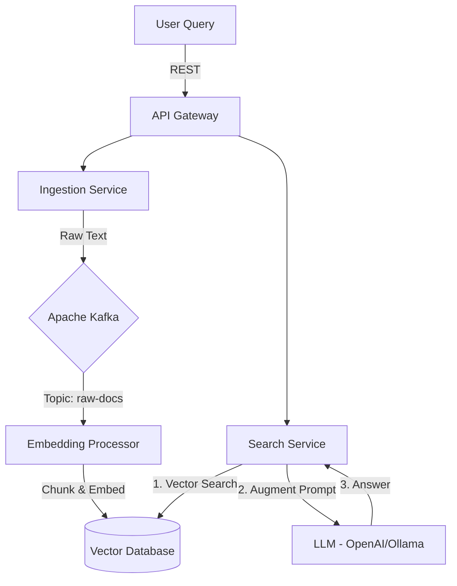

# spring-ai-search-engine

> An Enterprise-grade, Event-Driven AI Search Engine powered by Spring Boot 3.2+, Spring AI, and Kubernetes.

   

## 📖 Overview

**Spring AI RAG Engine** is a modular, microservices-based search platform designed to demonstrate the power of **Retrieval Augmented Generation (RAG)** in a Java environment. 

Unlike simple "chat with PDF" wrappers, this system is designed for scale. It decouples **Document Ingestion** (crawling, parsing, embedding) from **Search & Retrieval** using an event-driven architecture on **Apache Kafka**.

### 🏗 Architecture


```mermaid
graph TD
    User[User Query] -->|REST| Gateway[API Gateway]
    Gateway --> Search[Search Service]
    Gateway --> Ingest[Ingestion Service]
    
    Ingest -->|Raw Text| Kafka{Apache Kafka}
    Kafka -->|Topic: raw-docs| Processor[Embedding Processor]
    
    Processor -->|Chunk & Embed| VectorDB[(Vector Database)]
    
    Search -->|1. Vector Search| VectorDB
    Search -->|2. Augment Prompt| LLM[LLM - OpenAI/Ollama]
    LLM -->|3. Answer| Search
```

## 🚀 Key Features

*   **⚡️ Event-Driven Ingestion:** Uploads are asynchronous. Heavy processing (PDF parsing, OCR) doesn't block the user API.
*   **🧠 Spring AI Integration:** Native Java usage of `ChatClient`, `EmbeddingClient`, and `VectorStore`.
*   **🐳 Kubernetes Native:** Designed with Deployment, Service, and HPA manifests for production scaling.
*   **🔍 Hybrid Search:** Combines dense vector search with metadata filtering.
*   **🛡 Observability:** Built-in metrics (Micrometer) and tracing (OpenTelemetry) for monitoring token usage and costs.

## 🛠 Tech Stack

*   **Core:** Java 21, Spring Boot 3.2+
*   **AI Framework:** Spring AI
*   **Orchestration:** Kubernetes (K8s)
*   **Messaging:** Apache Kafka
*   **Vector Database:** Weaviate / PGVector (Configurable)
*   **LLM Provider:** OpenAI / Azure OpenAI / Ollama (Local)

## 🏃‍♂️ Getting Started

### Prerequisites

*   Java 21+
*   Docker & Docker Compose
*   Maven 3.9+

### Local Development (Docker Compose)

1.  **Clone the repository:**

    ```bash
    git clone https://github.com/your-username/spring-ai-rag-engine.git
    cd spring-ai-rag-engine
    ```

2.  **Start Infrastructure (Kafka, Vector DB):**

    ```bash
    docker-compose up -d
    ```

3.  **Build & Run Services:**

    ```bash
    mvn clean install
    # Terminal A
    java -jar ingestion-service/target/ingestion-service.jar
    # Terminal B
    java -jar search-service/target/search-service.jar
    ```

### ☸️ Kubernetes Deployment

See the `/k8s` directory for Helm charts and manifests.

```bash
kubectl apply -f k8s/namespace.yaml
kubectl apply -f k8s/infra/  # Deploys Kafka & Vector DB
kubectl apply -f k8s/apps/   # Deploys Spring Boot Apps
```