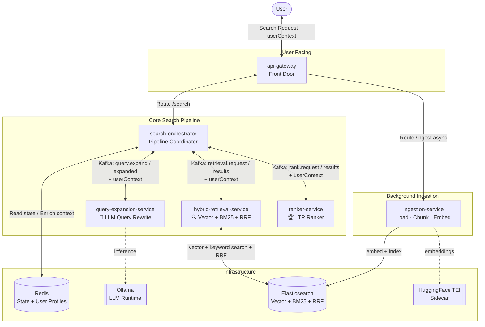
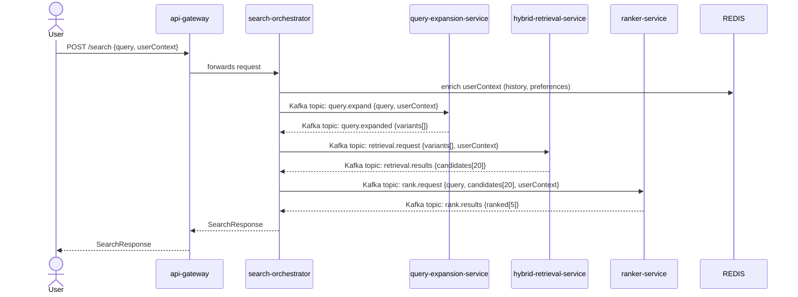

# spring-ai-search-engine

> An Enterprise-grade, Event-Driven AI Search Engine powered by Spring Boot 3.3+, Spring AI, Kafka, and Kubernetes.

[](https://openjdk.org/projects/jdk/21/)
[](https://spring.io/projects/spring-boot)
[](https://spring.io/projects/spring-ai)
[](https://kafka.apache.org/)
[](https://kubernetes.io/)

---

## 📖 Overview

**Spring AI Search Engine** is a fully decomposed, event-driven microservices platform for **personalized, AI-driven search**. Every stage of the search pipeline runs as an **independent service** communicating exclusively over **Apache Kafka** — enabling each component to be scaled, deployed, and tuned in isolation.

The pipeline covers the full journey from user intent to highly-relevant, **context-aware** ranked documents using a Learn to Rank (LTR) model — inspired by real-world systems like LINE MAN Wongnai's search evolution from keyword matching to semantic, intent-aware retrieval. A `UserContext` object (user history, location, preferences) is threaded through every pipeline stage, enabling each service to personalize its behavior.

---

## 🏗 Architecture

### Full System Architecture


```mermaid
flowchart TD
    U([User])

    subgraph User Facing
        GW[api-gateway<br>Front Door]
    end
    
    subgraph Core Search Pipeline
        ORCH[search-orchestrator<br>Pipeline Coordinator]
        QE[query-expansion-service<br>🧠 LLM Query Rewrite]
        HR[hybrid-retrieval-service<br>🔍 Vector + BM25 + RRF]
        RANK[ranker-service<br>🏆 LTR Ranker]
    end

    subgraph Background Ingestion
        IS[ingestion-service<br>Load · Chunk · Embed]
    end

    subgraph Infrastructure
        ES[(Elasticsearch<br>Vector + BM25 + RRF)]
        OL[[Ollama<br>LLM Runtime]]
        TEI[[HuggingFace TEI<br>Sidecar]]
        REDIS[(Redis<br>State + User Profiles)]
    end

    U <-->|Search Request + userContext| GW
    GW <-->|Route /search| ORCH
    GW -->|Route /ingest async| IS

    ORCH <-->|Read state / Enrich context| REDIS

    ORCH <-->|Kafka: query.expand / expanded<br>+ userContext| QE
    QE -.->|inference| OL
    
    ORCH <-->|Kafka: retrieval.request / results<br>+ userContext| HR
    HR <-->|vector + keyword search + RRF| ES
    
    ORCH <-->|Kafka: rank.request / results<br>+ userContext| RANK

    IS -->|embed + index| ES
    IS -.->|embeddings| TEI
```

### Kafka Topic Flow


```mermaid
sequenceDiagram
    actor User
    participant GW as api-gateway
    participant ORCH as search-orchestrator
    participant QE as query-expansion-service
    participant HR as hybrid-retrieval-service
    participant RANK as ranker-service

    User->>GW: POST /search {query, userContext}
    GW->>ORCH: forwards request
    ORCH->>REDIS: enrich userContext (history, preferences)

    ORCH->>QE: Kafka topic: query.expand {query, userContext}
    QE-->>ORCH: Kafka topic: query.expanded {variants[]}

    ORCH->>HR: Kafka topic: retrieval.request {variants[], userContext}
    HR-->>ORCH: Kafka topic: retrieval.results {candidates[20]}

    ORCH->>RANK: Kafka topic: rank.request {query, candidates[20], userContext}
    RANK-->>ORCH: Kafka topic: rank.results {ranked[5]}

    ORCH-->>GW: SearchResponse
    GW-->>User: SearchResponse
```

---

## 📦 Services

| Service | Responsibility | User Context Usage |
|---|---|---|
| `api-gateway` | Edge proxy, routes incoming traffic | Passes `userContext` through |
| `search-orchestrator` | Pipeline coordination, enriches user context from Redis | Loads full user profile (history, preferences) from Redis |
| `query-expansion-service` | LLM rewrites query into 2–3 semantic variants | Uses `recentSearches` + `preferences` for context-aware expansion |
| `hybrid-retrieval-service` | Dense vector + BM25 search via Elasticsearch RRF | Uses `location` for geo-boosting, `preferences` for field boosting |
| `ranker-service` | LTR model ranks and returns definitive top-5 | Uses full `userContext` as LTR feature signals |
| `ingestion-service` | Load, chunk, embed, index into Elasticsearch | — |

---

## 🗂 Module Structure

```
spring-ai-search-engine/
│
├── api-gateway/                            # Edge Gateway / Front Door
│   └── application.yml                   # Routes /ingest and /search
│
├── search-orchestrator/                  # Pipeline coordinator
│   ├── controller/
│   │   └── SearchController.java         # POST /search
│   ├── pipeline/
│   │   ├── PipelineOrchestrator.java     # Drives Kafka stages by correlationId
│   │   └── PipelineStateStore.java       # Redis state per in-flight request
│   └── kafka/
│       ├── SearchRequestPublisher.java
│       └── ResultConsumer.java           # Listens on all *.results topics
│
├── query-expansion-service/
│   ├── kafka/
│   │   ├── QueryExpandConsumer.java      # Listens: query.expand
│   │   └── QueryExpandedPublisher.java   # Publishes: query.expanded
│   └── service/
│       └── QueryExpansionService.java    # LLM → variant list
│
├── hybrid-retrieval-service/
│   ├── kafka/
│   │   ├── RetrievalRequestConsumer.java # Listens: retrieval.request
│   │   └── RetrievalResultPublisher.java # Publishes: retrieval.results
│   └── service/
│       └── HybridSearchService.java      # ES knn + BM25 + RRF in a single query
│
├── ranker-service/
│   ├── kafka/
│   │   ├── RankRequestConsumer.java      # Listens: rank.request
│   │   └── RankResultPublisher.java      # Publishes: rank.results
│   └── service/
│       └── DocumentRanker.java           # LTR ranking model
│
├── ingestion-service/
│   ├── controller/
│   │   └── IngestionController.java      # POST /ingest (Returns 202 Accepted)
│   ├── model/
│   │   └── IngestionMetadata.java        # Tracks Job status in Elasticsearch
│   ├── service/
│   │   ├── IngestionFacade.java          # Coordinates spooling & background worker
│   │   ├── AsyncIngestionWorker.java     # @Async worker for extraction and embedding
│   │   ├── TempFileCleanupTask.java      # Scheduled OS temp file cleanup
│   │   ├── ChunkingService.java          # TokenTextSplitter with overlaps
│   │   └── EmbeddingService.java         # Spring AI EmbeddingClient (TEI) → Elasticsearch
│   └── resources/
│       └── application.yml
│
├── shared/                               # Shared library — models + events
│   ├── event/
│   │   ├── QueryExpandEvent.java
│   │   ├── QueryExpandedEvent.java
│   │   ├── RetrievalRequestEvent.java
│   │   ├── RetrievalResultEvent.java
│   │   ├── RankRequestEvent.java
│   │   ├── RankResultEvent.java
│   │   ├── AnswerRequestEvent.java
│   │   └── AnswerResultEvent.java
│   ├── model/
│   │   ├── SearchRequest.java
│   │   ├── SearchResponse.java
│   │   ├── RankedDocument.java
│   │   ├── UserContext.java              # userId, location, preferences, recentSearches
│   │   └── GeoLocation.java             # lat/lon for proximity boosting
│   └── util/
│       └── CorrelationIdGenerator.java
│
└── docker-compose.yml

# Kubernetes manifests live in a separate repo:
# https://github.com/Peqchji/k8s-lab/tree/spring-ai-search-engine
```

---

## 🚀 Key Features

- **⚡ Fully Event-Driven** — every pipeline stage communicates exclusively over Kafka; no synchronous HTTP between services
- **👤 Personalized Search** — `UserContext` (history, location, preferences) is threaded through every pipeline stage for context-aware expansion, geo-boosted retrieval, and personalized ranking
- **📐 Independent Scalability** — scale `ranker-service` and `hybrid-retrieval-service` separately with their own HPAs
- **🔗 Correlation Tracking** — orchestrator tracks each request end-to-end via a `correlationId` threaded through all Kafka events
- **🧠 Query Expansion** — LLM rewrites ambiguous queries into multiple variants before retrieval, using user history and preferences for better context
- **🔍 Hybrid Search** — Elasticsearch dense vector (`knn`) + BM25 keyword search merged via built-in Reciprocal Rank Fusion (RRF) in a single query, with geo-proximity and preference boosting
- **🏆 Ranking Layer** — `ranker-service` accurately ranks documents using a Learn to Rank (LTR) model to return the definitive top-5. Implements **Claim Check pattern** where search results return only IDs and summaries to keep Kafka messages lean and API responses fast.
- **📄 Full Document Retrieval** — Dedicated endpoint to fetch the complete document content by ID after identifying relevant candidates.
- **⚙️ Zero Magic Strings** — Fully centralized `.env` configuration via SpEL and `@Value` injections.
- **🐳 Kubernetes Native** — one Deployment + HPA per service for targeted autoscaling
- **📊 Observability** — per-stage latency (Micrometer) and distributed tracing (OpenTelemetry)

---

## 🛠 Tech Stack

| Layer | Technology |
|---|---|
| Language | Java 21 |
| Framework | Spring Boot 3.3+, Spring AI 1.0 |
| Messaging | Apache Kafka |
| Vector + Keyword Search | Elasticsearch (knn + BM25 + RRF) |
| Generative LLM | Ollama (local) |
| Embedding API | HuggingFace TEI (Sidecar) |
| Orchestration | Kubernetes (K8s) |
| Observability | Micrometer + OpenTelemetry |

---

## 🏃 Getting Started

### Prerequisites

- Java 21+
- Docker & Docker Compose
- Maven 3.9+

### Environment Variables

```bash
# Ollama
OLLAMA_BASE_URL=http://localhost:11434
OLLAMA_MODEL=llama3.2

# Elasticsearch (Vector + Keyword + RRF)
SPRING_ELASTICSEARCH_URIS=http://localhost:9200
SPRING_AI_VECTORSTORE_ELASTICSEARCH_INDEX_NAME=document_chunks

# Kafka
SPRING_KAFKA_BOOTSTRAP_SERVERS=localhost:9092
```

### Local Development

```bash
# 1. Clone
git clone https://github.com/Peqchji/spring-ai-search-engine.git
cd spring-ai-search-engine
git checkout develop

# 2. Start all infrastructure
docker-compose up -d
# Starts: Kafka, Elasticsearch, Ollama, API Gateway, and Ingestion Service (w/ TEI sidecar)

# 3. Build all modules
mvn clean install

# 4. Start each service (separate terminals)
java -jar ingestion-service/target/ingestion-service.jar
java -jar query-expansion-service/target/query-expansion-service.jar
java -jar hybrid-retrieval-service/target/hybrid-retrieval-service.jar
java -jar ranker-service/target/ranker-service.jar
java -jar search-orchestrator/target/search-orchestrator.jar
```

### Quick Test

```bash
# Ingest a document (Async)
# Returns 202 Accepted with a tracking Job ID
curl -X POST http://localhost:8080/ingest \
  -F "file=@/path/to/document.pdf"

# Search (with user context for personalized results)
# Returns summaries for fast processing (Claim Check Pattern)
curl -X POST http://localhost:8080/search \
  -H "Content-Type: application/json" \
  -d '{
    "query": "What is the refund policy?",
    "userContext": {
      "userId": "user-123",
      "location": { "lat": 13.7563, "lon": 100.5018 },
      "preferences": ["electronics", "warranty"],
      "recentSearches": ["return laptop", "shipping damage"]
    }
  }'

# Get Full Document Detail
curl -X GET http://localhost:8080/documents/doc-uuid-1
```

---

## ☸️ Kubernetes Deployment

Kubernetes manifests are maintained in a separate repository:
**[github.com/Peqchji/k8s-lab — branch: spring-ai-search-engine](https://github.com/Peqchji/k8s-lab/tree/spring-ai-search-engine)**

```bash
git clone -b spring-ai-search-engine https://github.com/Peqchji/k8s-lab.git
cd k8s-lab

kubectl apply -f namespace.yaml
kubectl apply -f infra/    # Kafka, Elasticsearch, Ollama
kubectl apply -f apps/     # All 6 services
```

Recommended HPA targets:

| Service | Scale Driver | Min Replicas | Max Replicas |
|---|---|---|---|
| `hybrid-retrieval-service` | CPU / Kafka consumer lag | 2 | 10 |
| `ranker-service` | CPU / Kafka consumer lag | 2 | 8 |
| `query-expansion-service` | CPU | 1 | 4 |
| `search-orchestrator` | RPS | 2 | 8 |
| `ingestion-service` | CPU / queue depth | 1 | 4 |

---

## 🗺 Development Roadmap

| Phase | Goal | Status |
|---|---|---|
| 1 | Stabilize `ingestion-service` + Elasticsearch indexing end-to-end | ✅ Done |
| 2 | `query-expansion-service` — Kafka consumer/producer + LLM prompt | ✅ Done |
| 3 | `hybrid-retrieval-service` — Elasticsearch knn + BM25 + RRF | ✅ Done |
| 4 | `ranker-service` — LTR model ranking | ✅ Done |
| 5 | `search-orchestrator` — correlationId state machine | ✅ Done |
| 6 | Observability: per-stage tracing + Kafka lag dashboards | 🔲 Planned |

---

## 📄 Documentation

- [`AGENTIC.md`](./AGENTIC.md) — Agentic pipeline design, LLM reranker details, Kafka topic contracts, and prompt templates

---

## 📜 License

MIT License. See [LICENSE](./LICENSE) for details.
